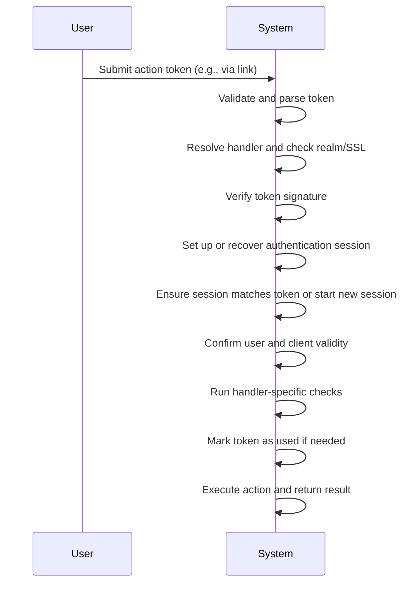
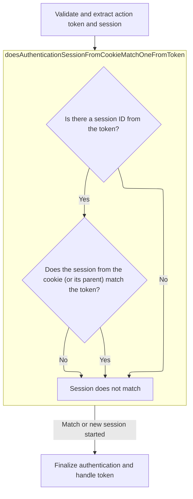
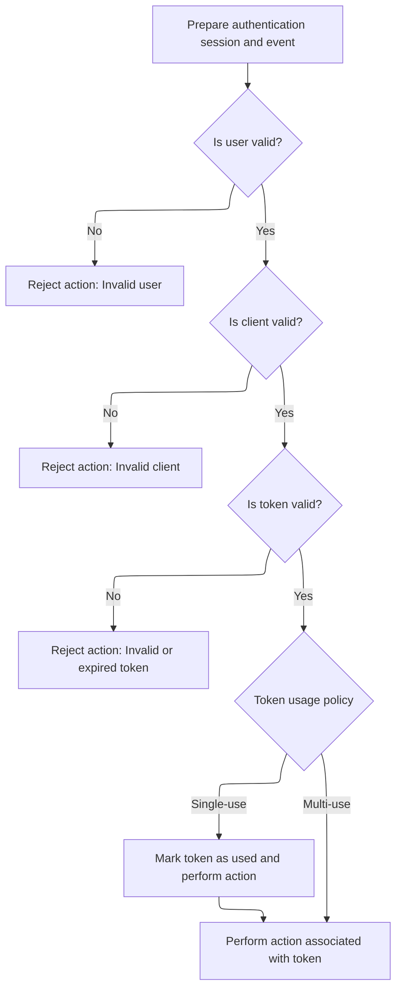

This document outlines how action tokens are processed to securely perform user-driven actions such as password resets or email verification. The flow validates the token, manages the session context to prevent confusion, and executes the requested action only if all security checks pass.

The main steps are:

- Validate and parse the action token
- Resolve the appropriate handler
- Check realm and SSL requirements
- Verify the token's signature
- Set up or recover the correct authentication session
- Ensure session matches the token context or start a new session
- Confirm user and client validity
- Run handler-specific checks and mark the token as used if needed
- Execute the action and return the result



# Spec

- The system must accept an incoming request with the following inputs:
  - An action token (JWT string)
  - Optional context parameters: execution ID, client ID, tab ID, and client data
- The action token must be a JWT containing at least these fields:
  - id (unique identifier)
  - actionId (type of action)
  - userId (target user)
  - issuedFor (client ID)
  - Optionally: compoundAuthenticationSessionId (session context)
- The system must validate that the JWT is authentic and unexpired.
- The system must determine the type of action to perform based on the actionId field in the token.
- The system must ensure that the authentication session referenced by the token matches the session from the user's request context. If not, the system must associate the request with a valid session for the client and token context.
- The authentication session must support:
  - Unique session ID and tab ID
  - Association with a client
  - Ability to store authentication and client notes
  - Association with an authenticated user
  - Current action being performed
  - Redirect URI for post-action redirection
- The system must enforce business rule checks for the token and context before performing the action. If any check fails, the process must be aborted and an error response returned.
- The system must enforce token usage policy:
  - For single-use tokens, the system must reject requests if the token has already been used. After successful processing, the token must be marked as used.
  - For multi-use tokens, this check is not required.
- The system must validate before executing the action:
  - The user referenced by the token exists and is valid
  - The client referenced by the token exists and is valid
  - The token is not expired and is valid
  - The realm is enabled
  - SSL is present if required
- The system must return a response based on the outcome:
  - On success: a redirect to the next step, a confirmation page, or a rendered login/info page
  - On failure: an error response with a specific error code and message appropriate to the failure reason (e.g., invalid user, disabled user, invalid client, expired token, invalid token, token already used, realm disabled, SSL required, malformed request)
- For email verification actions:
  - The user ID in the token must match the session user
  - If the token contains an email, it must match the user's current email
  - The client in the token must be valid and enabled
  - On success, the user's email must be marked as verified, the required action for email verification removed from the user, the event logged, and a redirect or confirmation response returned
- For password reset actions:
  - The user, client, and token usage must be verified
  - On success, a flag must be set in the session to indicate password reset is in progress and the user must be redirected to the password reset page
- The system must support session relationships to allow recovery of the parent session in case of forked flows

# Where is this flow used?

This flow is used multiple times in the codebase as represented in the following diagram:

```mermaid
graph TD;
      42f257fba58eb272cdd212c9b6511cfbe6985ee057a3162302191d8d473a1c7c(LoginActionsService.java::LoginActionsService.resetCredentialsPOST) --> c0550efe72619e0440ddce3a76b293af923ddce3156a6c8fec78d41a0ee184a5(LoginActionsService.java::LoginActionsService.handleActionToken)

99faee8c0674af485a51151085ad5d98672f424cec49ce736db6c198132cf3cf(LoginActionsService.java::LoginActionsService.executeActionToken) --> c0550efe72619e0440ddce3a76b293af923ddce3156a6c8fec78d41a0ee184a5(LoginActionsService.java::LoginActionsService.handleActionToken)

2025f79ce22bc9001c30820ffb8ff8eea5e1ee0a42bf49c34f9b33fb22ab4cbe(LoginActionsService.java::LoginActionsService.preHandleActionToken) --> c0550efe72619e0440ddce3a76b293af923ddce3156a6c8fec78d41a0ee184a5(LoginActionsService.java::LoginActionsService.handleActionToken)

1f13cb926309a3c3b2060bca2a96b9ac2d26c9f168c12bcffe9ed5bddd98cca1(LoginActionsService.java::LoginActionsService.registerPage) --> 2025f79ce22bc9001c30820ffb8ff8eea5e1ee0a42bf49c34f9b33fb22ab4cbe(LoginActionsService.java::LoginActionsService.preHandleActionToken)

e868a923943238fa9bc2b8e7c058b82b96f6be6d313d7ef285296885531c1d07(LoginActionsService.java::LoginActionsService.processRegister) --> 2025f79ce22bc9001c30820ffb8ff8eea5e1ee0a42bf49c34f9b33fb22ab4cbe(LoginActionsService.java::LoginActionsService.preHandleActionToken)

c98bd1e863bbd77e9b93926e7e9723d7de1daf3cbf8d26a65595c55d811431c9(AuthorizationEndpoint.java::AuthorizationEndpoint.register) --> 2025f79ce22bc9001c30820ffb8ff8eea5e1ee0a42bf49c34f9b33fb22ab4cbe(LoginActionsService.java::LoginActionsService.preHandleActionToken)

a0a81975e39d6169fb30859b4a79c11da19cdb9fd73b76d0c9611e39e1fec419(OIDCLoginProtocolService.java::OIDCLoginProtocolService.registrations) --> c98bd1e863bbd77e9b93926e7e9723d7de1daf3cbf8d26a65595c55d811431c9(AuthorizationEndpoint.java::AuthorizationEndpoint.register)


classDef mainFlowStyle color:#000000,fill:#7CB9F4
classDef rootsStyle color:#000000,fill:#00FFF4
classDef Style1 color:#000000,fill:#00FFAA
classDef Style2 color:#000000,fill:#FFFF00
classDef Style3 color:#000000,fill:#AA7CB9
```



# Processing and Validating Action Tokens



<SwmSnippet path="/services/src/main/java/org/keycloak/services/resources/LoginActionsService.java" line="551" repo-id="Z2l0aHViJTNBJTNBa2V5Y2xvYWslM0ElM0Fzd2ltbWlv">

---

In `handleActionToken`, we kick off by verifying the incoming action token: parse it, resolve the handler, check realm and SSL, and verify the signature. If the token is valid, we set up the context and optionally call a preHandleToken hook. If an authentication session isn't present or doesn't match the token, we call `startFreshAuthenticationSession` to guarantee we're working with a clean session tied to the right client and token context. This avoids session confusion and keeps the flow secure.

```java
    protected <T extends JsonWebToken & SingleUseObjectKeyModel> Response handleActionToken(String tokenString, String execution, String clientId, String tabId, String clientData, 
            TriFunction<ActionTokenHandler<T>, T, ActionTokenContext<T>, Response> preHandleToken) {
        T token;
        ActionTokenHandler<T> handler;
        ActionTokenContext<T> tokenContext;
        String eventError = null;
        String defaultErrorMessage = null;

        AuthenticationSessionModel authSession = null;

        // Setup client, so error page will contain "back to application" link
        ClientModel client = null;
        if (clientId != null) {
            client = realm.getClientByClientId(clientId);
        }
        AuthenticationSessionManager authenticationSessionManager = new AuthenticationSessionManager(session);
        KeycloakContext sessionContext = session.getContext();

        if (client != null) {
            sessionContext.setClient(client);
            authSession = authenticationSessionManager.getCurrentAuthenticationSession(realm, client, tabId);
        }

        event.event(EventType.EXECUTE_ACTION_TOKEN);

        // First resolve action token handler
        try {
            if (tokenString == null) {
                throw new ExplainedTokenVerificationException(null, Errors.NOT_ALLOWED, Messages.INVALID_REQUEST);
            }

            TokenVerifier<DefaultActionTokenKey> tokenVerifier = TokenVerifier.create(tokenString, DefaultActionTokenKey.class);
            DefaultActionTokenKey aToken = tokenVerifier.getToken();

            event
              .detail(Details.TOKEN_ID, aToken.getId())
              .detail(Details.ACTION, aToken.getActionId())
              .user(aToken.getUserId());

            handler = resolveActionTokenHandler(aToken.getActionId());
            eventError = handler.getDefaultEventError();
            defaultErrorMessage = handler.getDefaultErrorMessage();

            if (! realm.isEnabled()) {
                throw new ExplainedTokenVerificationException(aToken, Errors.REALM_DISABLED, Messages.REALM_NOT_ENABLED);
            }
            if (! checkSsl()) {
                throw new ExplainedTokenVerificationException(aToken, Errors.SSL_REQUIRED, Messages.HTTPS_REQUIRED);
            }

            TokenVerifier<DefaultActionTokenKey> verifier = tokenVerifier
                    .withChecks(
                            // Token introspection checks
                            TokenVerifier.IS_ACTIVE,
                            new TokenVerifier.RealmUrlCheck(Urls.realmIssuer(sessionContext.getUri().getBaseUri(), realm.getName())),
                            ACTION_TOKEN_BASIC_CHECKS
                    );

            String kid = verifier.getHeader().getKeyId();
            String algorithm = verifier.getHeader().getAlgorithm().name();

            SignatureVerifierContext signatureVerifier = session.getProvider(SignatureProvider.class, algorithm).verifier(kid);
            verifier.verifierContext(signatureVerifier);

            verifier.verify();

            token = TokenVerifier.create(tokenString, handler.getTokenClass()).getToken();
        } catch (TokenNotActiveException ex) {
            if (authSession != null) {
                event.clone().error(Errors.EXPIRED_CODE);
                String flowPath = authSession.getClientNote(AuthorizationEndpointBase.APP_INITIATED_FLOW);
                if (flowPath == null) {
                    flowPath = AUTHENTICATE_PATH;
                }
                AuthenticationProcessor.resetFlow(authSession, flowPath);

                // Process correct flow
                return processFlowFromPath(flowPath, authSession, Messages.EXPIRED_ACTION_TOKEN_SESSION_EXISTS);
            }

            return handleActionTokenVerificationException(null, ex, Errors.EXPIRED_CODE, Messages.EXPIRED_ACTION_TOKEN_NO_SESSION);
        } catch (ExplainedTokenVerificationException ex) {
            return handleActionTokenVerificationException(null, ex, ex.getErrorEvent(), ex.getMessage());
        } catch (ExplainedVerificationException ex) {
            return handleActionTokenVerificationException(null, ex, ex.getErrorEvent(), ex.getMessage());
        } catch (VerificationException ex) {
            return handleActionTokenVerificationException(null, ex, eventError, defaultErrorMessage);
        }

        // Now proceed with the verification and handle the token
        tokenContext = new ActionTokenContext<>(session, realm, sessionContext.getUri(), clientConnection, request, event, handler, execution, clientData, this::processFlow, this::brokerLoginFlow);

        if (preHandleToken != null) {
            return preHandleToken.apply(handler, token, tokenContext);
        }

        try {
            String tokenAuthSessionCompoundId = handler.getAuthenticationSessionIdFromToken(token, tokenContext, authSession);

            if (authSession == null) {
                authSession = handler.startFreshAuthenticationSession(token, tokenContext);
```

---

</SwmSnippet>

<SwmSnippet path="/services/src/main/java/org/keycloak/authentication/actiontoken/AbstractActionTokenHandler.java" line="98" repo-id="Z2l0aHViJTNBJTNBa2V5Y2xvYWslM0ElM0Fzd2ltbWlv">

---

We create a new session for the client from the token and make sure it ends after required actions.

```java
    public AuthenticationSessionModel startFreshAuthenticationSession(T token, ActionTokenContext<T> tokenContext) {
        AuthenticationSessionModel authSession = tokenContext.createAuthenticationSessionForClient(token.getIssuedFor());
        authSession.setAuthNote(AuthenticationManager.END_AFTER_REQUIRED_ACTIONS, "true");
        return authSession;
    }
```

---

</SwmSnippet>

<SwmSnippet path="/services/src/main/java/org/keycloak/services/resources/LoginActionsService.java" line="652" repo-id="Z2l0aHViJTNBJTNBa2V5Y2xvYWslM0ElM0Fzd2ltbWlv">

---

Back in `handleActionToken`, after starting a fresh session if needed, we check if the session from the user's cookie matches the one referenced by the token. This avoids session mix-ups, especially with multiple tabs or flows, and keeps the context correct.

```java
                tokenContext.setAuthenticationSession(authSession, true);
            } else if (!LoginActionsServiceChecks.doesAuthenticationSessionFromCookieMatchOneFromToken(tokenContext, authSession, tokenAuthSessionCompoundId)) {
                // There exists an authentication session but no auth session ID was received in the action token
                logger.debugf("Authentication session in progress but no authentication session ID was found in action token %s, restarting.", token.getId());
```

---

</SwmSnippet>

## Validating Session Consistency

<SwmSnippet path="/services/src/main/java/org/keycloak/services/resources/LoginActionsServiceChecks.java" line="256" repo-id="Z2l0aHViJTNBJTNBa2V5Y2xvYWslM0ElM0Fzd2ltbWlv">

---

We compare session IDs, and if there's a fork, we try to recover the parent session to keep the context right.

```java
    public static <T extends JsonWebToken> boolean doesAuthenticationSessionFromCookieMatchOneFromToken(
            ActionTokenContext<T> context, AuthenticationSessionModel authSessionFromCookie, String authSessionCompoundIdFromToken) throws VerificationException {
        if (authSessionCompoundIdFromToken == null) {
            return false;
        }


        if (Objects.equals(AuthenticationSessionCompoundId.fromAuthSession(authSessionFromCookie).getEncodedId(), authSessionCompoundIdFromToken)) {
            context.setAuthenticationSession(authSessionFromCookie, false);
            return true;
        }

        // Check if it's forked session. It would have same parent (rootSession) as our browser authenticationSession
        String parentTabId = authSessionFromCookie.getAuthNote(AuthenticationProcessor.FORKED_FROM);
        if (parentTabId == null) {
            return false;
        }


        AuthenticationSessionModel authSessionFromParent = authSessionFromCookie.getParentSession().getAuthenticationSession(authSessionFromCookie.getClient(), parentTabId);
        if (authSessionFromParent == null) {
            return false;
        }

```

---

</SwmSnippet>

### Fetching Client Details and Permissions

See <SwmLink doc-title="Retrieving client details flow" repo-id="Z2l0aHViJTNBJTNBa2V5Y2xvYWslM0ElM0Fzd2ltbWlv" path="/.swm/retrieving-client-details-flow.dw2kzbd0.sw.md">[Retrieving client details flow](https://staging.swimm.cloud/repos/Z2l0aHViJTNBJTNBa2V5Y2xvYWslM0ElM0FrZXljbG9haw%3D%3D/docs/dw2kzbd0)</SwmLink>

### Switching to the Correct Session Context

<SwmSnippet path="/services/src/main/java/org/keycloak/services/resources/LoginActionsServiceChecks.java" line="280" repo-id="Z2l0aHViJTNBJTNBa2V5Y2xvYWslM0ElM0Fzd2ltbWlv">

---

Back in `doesAuthenticationSessionFromCookieMatchOneFromToken`, after fetching the parent session for a forked flow, we switch the context to that session and update the execution ID. This keeps the user's flow intact even if they're bouncing between tabs.

```java
        // It's the correct browser. We won't continue login
        // from the login form (browser flow) but from the token's flow
        // Don't expire KC_RESTART cookie at this point
        LOG.debugf("Switched to forked tab: %s from: %s . Root session: %s", authSessionFromParent.getTabId(), authSessionFromCookie.getTabId(), authSessionFromCookie.getParentSession().getId());

        context.setAuthenticationSession(authSessionFromParent, false);
        context.setExecutionId(authSessionFromParent.getAuthNote(AuthenticationProcessor.LAST_PROCESSED_EXECUTION));

        return true;
    }
```

---

</SwmSnippet>

## Resetting Session on Mismatch



<SwmSnippet path="/services/src/main/java/org/keycloak/services/resources/LoginActionsService.java" line="656" repo-id="Z2l0aHViJTNBJTNBa2V5Y2xvYWslM0ElM0Fzd2ltbWlv">

---

Back in `handleActionToken`, if the session doesn't match, we remove the old session and start a new one to guarantee a clean slate. This avoids leaking any previous state and keeps the flow isolated.

```java
                authenticationSessionManager.removeAuthenticationSession(realm, authSession, false);

                authSession = handler.startFreshAuthenticationSession(token, tokenContext);
                tokenContext.setAuthenticationSession(authSession, true);

                processLocaleParam(authSession);
            }

```

---

</SwmSnippet>

<SwmSnippet path="/services/src/main/java/org/keycloak/services/resources/LoginActionsService.java" line="664" repo-id="Z2l0aHViJTNBJTNBa2V5Y2xvYWslM0ElM0Fzd2ltbWlv">

---

Back in `handleActionToken`, after starting a new session, we update the session context, initialize the login event, and check that both the user and client are valid. This blocks tokens from being used in invalid or unauthorized contexts.

```java
            sessionContext.setAuthenticationSession(authSession);
            initLoginEvent(authSession);
            event.event(handler.eventType());

            LoginActionsServiceChecks.checkIsUserValid(token, tokenContext, event);
            LoginActionsServiceChecks.checkIsClientValid(token, tokenContext);

            sessionContext.setClient(authSession.getClient());

```

---

</SwmSnippet>

<SwmSnippet path="/services/src/main/java/org/keycloak/services/resources/LoginActionsService.java" line="673" repo-id="Z2l0aHViJTNBJTNBa2V5Y2xvYWslM0ElM0Fzd2ltbWlv">

---

Back in `handleActionToken`, after checking user and client, we run handler-specific verifiers, mark the token as used if needed, set some session notes, and finally hand off to the handler to process the token. This wraps up the action token flow and returns the response.

```java
            TokenVerifier.createWithoutSignature(token)
              .withChecks(handler.getVerifiers(tokenContext))
              .verify();

            authSession = tokenContext.getAuthenticationSession();
            event = tokenContext.getEvent();
            event.event(handler.eventType());

            if (! handler.canUseTokenRepeatedly(token, tokenContext)) {
                LoginActionsServiceChecks.checkTokenWasNotUsedYet(token, tokenContext);
                authSession.setAuthNote(AuthenticationManager.INVALIDATE_ACTION_TOKEN, token.serializeKey());
            }

            authSession.setAuthNote(DefaultActionTokenKey.ACTION_TOKEN_USER_ID, token.getUserId());

            authSession.setAuthNote(Constants.KEY, tokenString);

            return handler.handleToken(token, tokenContext);
        } catch (ExplainedTokenVerificationException ex) {
            return handleActionTokenVerificationException(tokenContext, ex, ex.getErrorEvent(), ex.getMessage());
        } catch (LoginActionsServiceException ex) {
            Response response = ex.getResponse();
            return response == null
              ? handleActionTokenVerificationException(tokenContext, ex, eventError, defaultErrorMessage)
              : response;
        } catch (VerificationException ex) {
            return handleActionTokenVerificationException(tokenContext, ex, eventError, defaultErrorMessage);
        }
    }
```

---

</SwmSnippet>

&nbsp;

*This is an auto-generated document by Swimm 🌊 and has not yet been verified by a human*

<SwmMeta version="3.0.0"><sup>Powered by [Swimm](https://staging.swimm.cloud/)</sup></SwmMeta>
