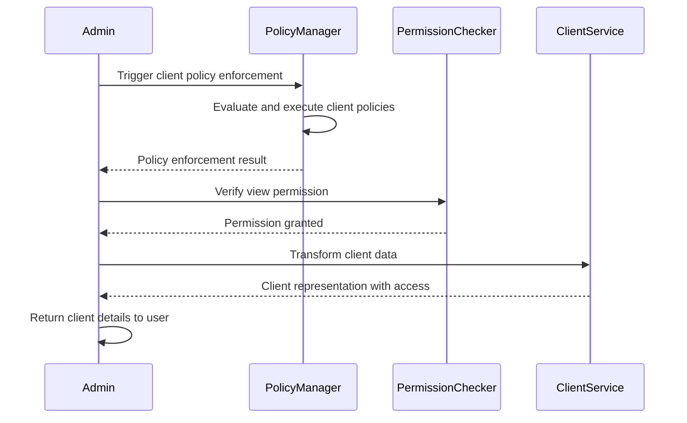
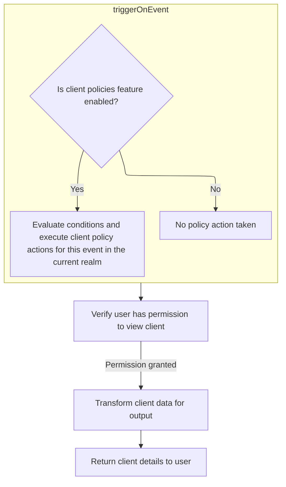
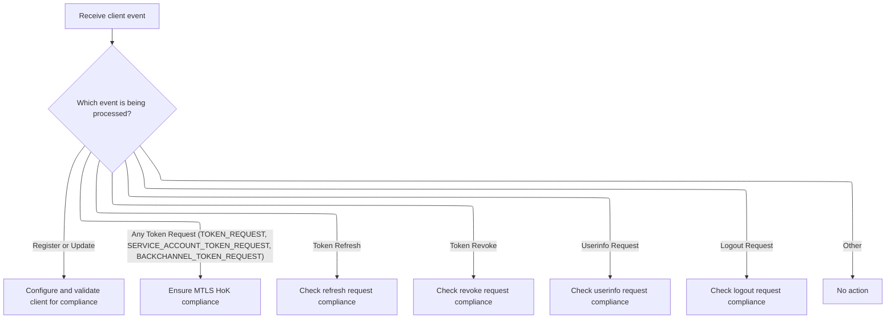

This document describes the process of retrieving client information with enforced client policies and permission checks.

The main steps are:

- Enforce client policies before viewing the client
- Verify user permissions to view the client
- Convert client data to a representation
- Attach user access permissions
- Return client details



# Spec

- The system must only return client details if both of the following conditions are met:
  - All client policies for the current realm are satisfied for viewing the client.
  - The user has permission to view the specified client.
- If either condition is not met, the system must return an error response with:
  - An error code (string)
  - An error detail (string)
  - An HTTP status code of 400
- Input:
  - client identifier (string)
  - authentication context (string or token)
  - session context (string or token)
- Output (on success): a JSON object representing the client, containing at least the following fields:
  - id (string)
  - clientId (string)
  - name (string)
  - enabled (boolean)
  - protocol (string)
  - redirectUris (list of strings)
  - webOrigins (list of strings)
  - access (object with boolean fields: view, manage, configure)
  - All other client configuration fields that are available to API consumers
- If the required conditions are not met, no client details are returned and only the error response is provided.

# Starting the client retrieval process



<SwmSnippet path="/services/src/main/java/org/keycloak/services/resources/admin/ClientResource.java" line="190" repo-id="Z2l0aHViJTNBJTNBa2V5Y2xvYWslM0ElM0FrZXljbG9haw==">

---

In `getClient`, we kick things off by triggering a client policy event using the current client and admin context. This step checks if any client-specific policies need to be enforced before we let the admin see the client details. If a policy fails, we throw an error and stop right here. We assume 'client', 'auth', and 'session' are all valid and ready to use at this point. Calling `triggerOnEvent` is what actually enforces these policies before anything else happens.

```java
    public ClientRepresentation getClient() {
        try {
            session.clientPolicy().triggerOnEvent(new AdminClientViewContext(client, auth.adminAuth()));
        } catch (ClientPolicyException cpe) {
            throw new ErrorResponseException(cpe.getError(), cpe.getErrorDetail(), Response.Status.BAD_REQUEST);
        }

```

---

</SwmSnippet>

## Evaluating client policy conditions and actions

<SwmSnippet path="/services/src/main/java/org/keycloak/services/clientpolicy/DefaultClientPolicyManager.java" line="48" repo-id="Z2l0aHViJTNBJTNBa2V5Y2xvYWslM0ElM0FrZXljbG9haw==">

---

`triggerOnEvent` checks if client policies are enabled. If they are, it runs policy conditions and then executes policy actions for the current event and realm. The next step, calling `executeOnEvent`, is where the actual enforcement logic for the event happens—like checking certificates or validating client updates.

```java
    public void triggerOnEvent(ClientPolicyContext context) throws ClientPolicyException {
        if (!Profile.isFeatureEnabled(Profile.Feature.CLIENT_POLICIES)) {
            return;
        }

        RealmModel realm = session.getContext().getRealm();
        logger.tracev("POLICY OPERATION :: context realm = {0}, event = {1}", realm.getName(), context.getEvent());

        doPolicyOperation(
                (ClientPolicyConditionProvider condition) -> condition.applyPolicy(context),
                (ClientPolicyExecutorProvider executor) -> executor.executeOnEvent(context),
                realm
        );
    }
```

---

</SwmSnippet>

## Enforcing event-specific client policy logic



<SwmSnippet path="/services/src/main/java/org/keycloak/services/clientpolicy/executor/HolderOfKeyEnforcerExecutor.java" line="83" repo-id="Z2l0aHViJTNBJTNBa2V5Y2xvYWslM0ElM0FrZXljbG9haw==">

---

`executeOnEvent` looks at the event type and runs the relevant logic for each one. For USERINFO_REQUEST, it calls `checkUserInfo` to make sure the access token is tied to the client certificate in the request. This branching is how we enforce different policies for different client actions.

```java
    public void executeOnEvent(ClientPolicyContext context) throws ClientPolicyException {
        HttpRequest request = session.getContext().getHttpRequest();
        switch (context.getEvent()) {
            case REGISTER:
            case UPDATE:
                ClientCRUDContext clientUpdateContext = (ClientCRUDContext)context;
                autoConfigure(clientUpdateContext.getProposedClientRepresentation());
                validate(clientUpdateContext.getProposedClientRepresentation());
                break;
            case TOKEN_REQUEST:
            case SERVICE_ACCOUNT_TOKEN_REQUEST:
            case BACKCHANNEL_TOKEN_REQUEST:
                AccessToken.Confirmation certConf = MtlsHoKTokenUtil.bindTokenWithClientCertificate(request, session);
                if (certConf == null) {
                    throw new ClientPolicyException(OAuthErrorException.INVALID_REQUEST, "Client Certification missing for MTLS HoK Token Binding");
                }
                break;
            case TOKEN_REFRESH:
                checkTokenRefresh((TokenRefreshContext) context, request);
                break;
            case TOKEN_REVOKE:
                checkTokenRevoke((TokenRevokeContext) context, request);
                break;
            case USERINFO_REQUEST:
                checkUserInfo((UserInfoRequestContext) context, request);
                break;
            case LOGOUT_REQUEST:
                checkLogout((LogoutRequestContext) context, request);
                break;
            default:
                return;
        }
    }
```

---

</SwmSnippet>

<SwmSnippet path="/services/src/main/java/org/keycloak/services/clientpolicy/executor/HolderOfKeyEnforcerExecutor.java" line="145" repo-id="Z2l0aHViJTNBJTNBa2V5Y2xvYWslM0ElM0FrZXljbG9haw==">

---

`checkUserInfo` decodes the access token from the request context and checks if it's bound to the client certificate. If the binding fails, it throws an exception and blocks the request with a 401 error. If the token can't be decoded, it just returns without doing anything.

```java
    private void checkUserInfo(UserInfoRequestContext context, HttpRequest request) throws ClientPolicyException {
        String encodedAccessToken = context.getTokenForUserInfo().getToken();

        AccessToken accessToken = session.tokens().decode(encodedAccessToken, AccessToken.class);
        if (accessToken == null) {
            // this executor does not treat this error case.
            return;
        }

        if (!MtlsHoKTokenUtil.verifyTokenBindingWithClientCertificate(accessToken, request, session)) {
            throw new ClientPolicyException(Errors.NOT_ALLOWED, MtlsHoKTokenUtil.CERT_VERIFY_ERROR_DESC, Response.Status.UNAUTHORIZED);
        }
    }
```

---

</SwmSnippet>

## Finalizing and returning the client representation

<SwmSnippet path="/services/src/main/java/org/keycloak/services/resources/admin/ClientResource.java" line="197" repo-id="Z2l0aHViJTNBJTNBa2V5Y2xvYWslM0ElM0FrZXljbG9haw==">

---

Back in `getClient`, after returning from `triggerOnEvent`, we check if the user is allowed to view the client. Then we convert the client model to a representation object and attach the user's access permissions to it. This is what gets sent back to the frontend, so the UI knows what actions are allowed.

```java
        auth.clients().requireView(client);

        ClientRepresentation representation = ModelToRepresentation.toRepresentation(client, session);

        representation.setAccess(auth.clients().getAccess(client));

        return representation;
    }
```

---

</SwmSnippet>

&nbsp;

*This is an auto-generated document by Swimm 🌊 and has not yet been verified by a human*

<SwmMeta version="3.0.0"><sup>Powered by [Swimm](https://staging.swimm.cloud/)</sup></SwmMeta>
